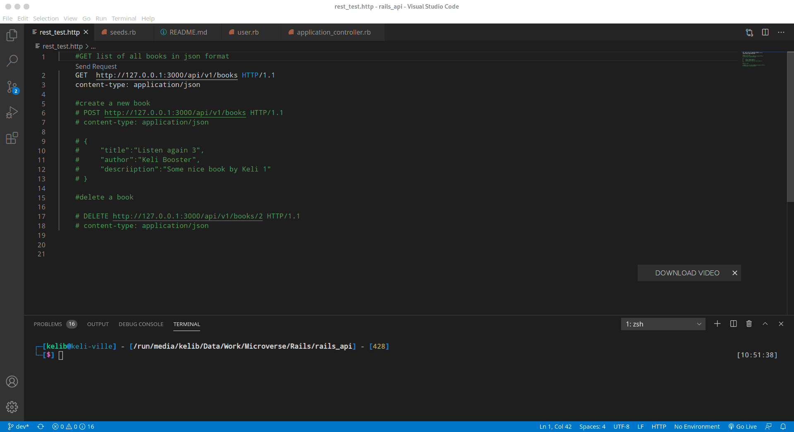

# rails_api

A basic Rails Api To create Book.
- Users can add books by posting it to the Books endpoint
- Users can remove specific Books
  - users can update specific books




## What it does


## Built With

- Ruby v2.7.1p83 
- Ruby on Rails v6.0.3.4

*Gems used:*

- Devise (for user authentication)

## Getting Started

To get a local copy up, clone it and running follow these simple example steps.

### Prerequisites

- Ruby: 2.7.1p83 
- Rails: 6.0.3.4
- Postgres: >= 9.5

### Setup

Install gems with:

``` bash
bundle install
```

Setup database with:

``` bash
   rails db:create
   rails db:migrate
   rails db:seed 
```


### Usage

Start server with:

``` bash
    rails server
```
refer to [docs ](docs.md) for more information on how to use the api

Open `http://localhost:3000/` in your browser.

## Author

👤 **Kelly Booster**

- Github: [@kelibst](https://github.com/kelibst)
- Twitter: [@keli_booster](https://twitter.com/keli_booster)
- Linkedin: [Kekeli (Jiresse) Dogbevi
](https://www.linkedin.com/in/kekeli-dogbevi-958272108/)

## 🤝 Contributing

Contributions, issues and feature requests are welcome! Start by:

- Forking the project.
- Cloning the project to your local machine.
- cd into the project directory.
- Run git checkout -b your-branch-name.
- Make your contributions.
- Push your branch up to your forked repository.
- Open a Pull Request with a detailed description to the development branch of the original project for a review.

## Show your support

Give a ⭐️ if you like this project!

## Acknowledgments

- Microverse
- [Gregoire Veila](https://www.behance.net/gallery/14286087/Twitter-Redesign-of-UI-details)

## 📝 License
