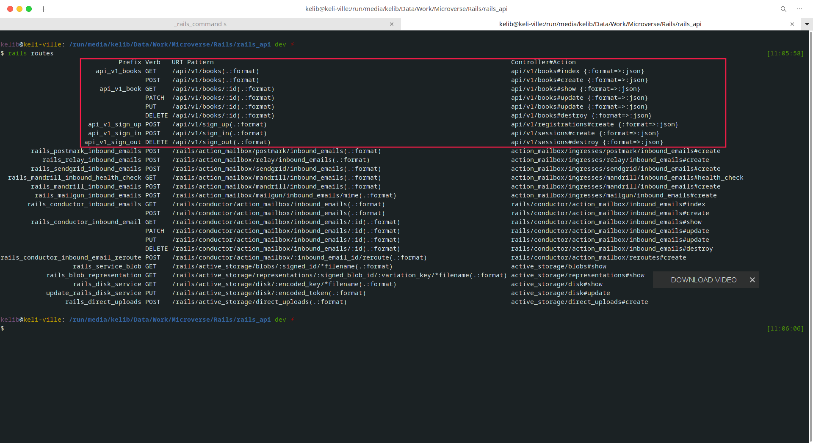
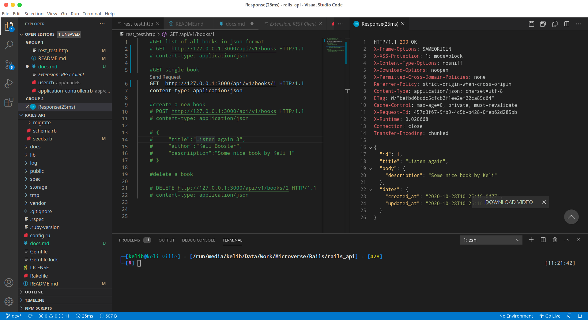

# Complete documentation for using this Api

### Check Available endpoints 

- open your terminal in the root of the folder and type
 `rails routes to view available endpoints`
   
   - GET localhost/api/v1/books    
   - POST localhost/api/v1/books 
   - GET localhost/api/v1/books/1 
   - DELETE localhost/api/v1/books/1 

### Test end points with VS Code REsT Client extension
- Open Vs code
    - Press CTl Shift X to open entensions
    - Type in Rest Client to find exntension
    - Click on install

- Open [rest_test.http](rest_test.http)
    - Run Tests one after the other
    - NB while Running Test make sure you comment the other test out.

